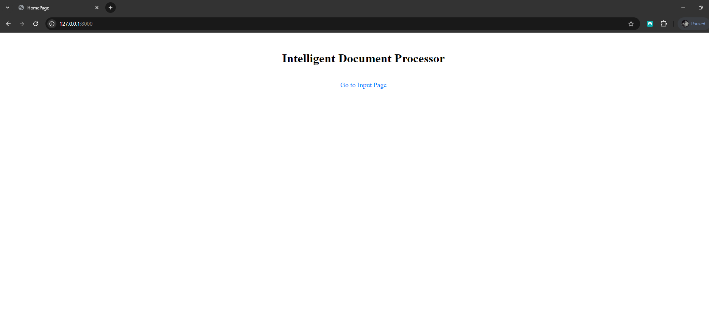
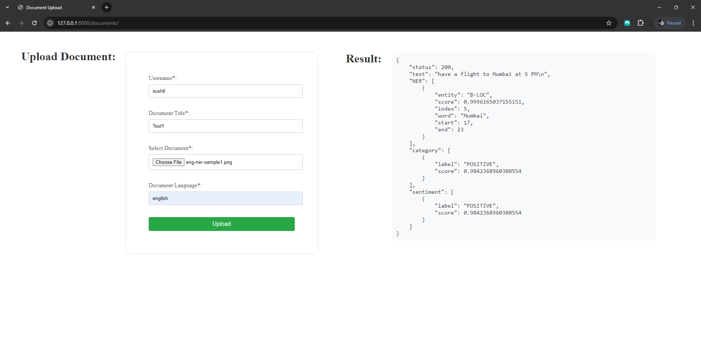
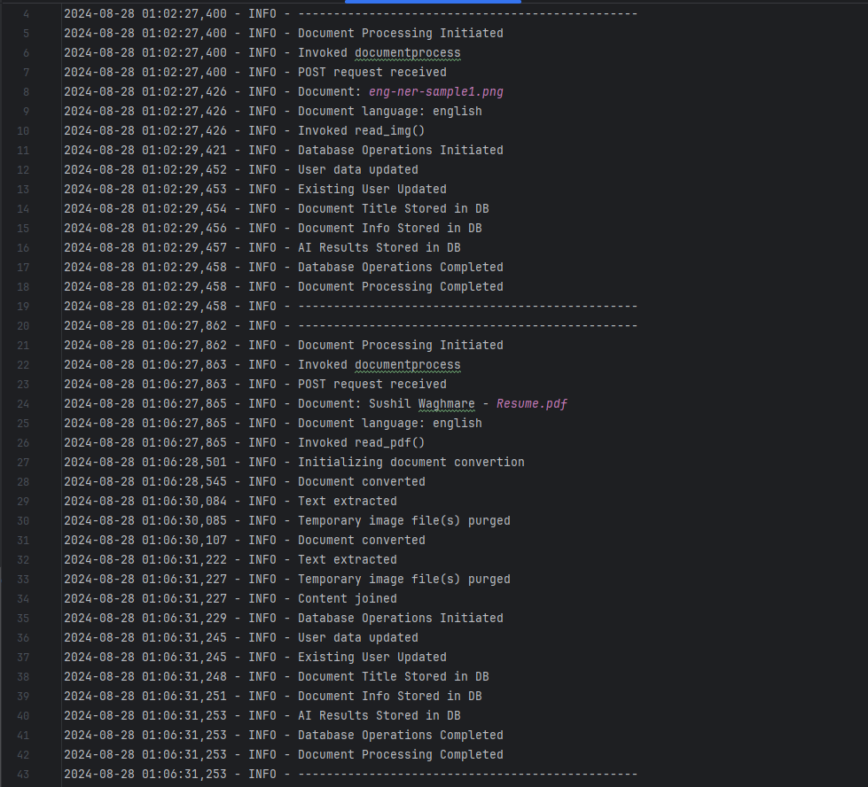
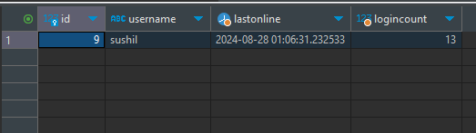
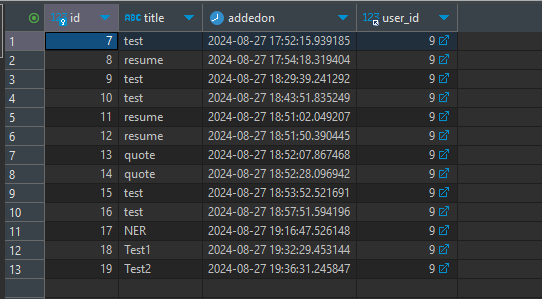
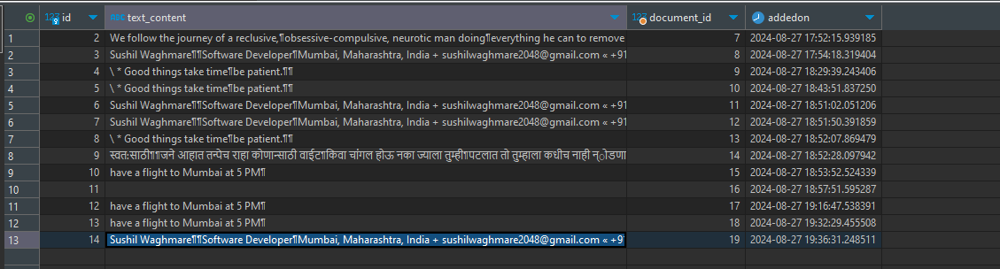
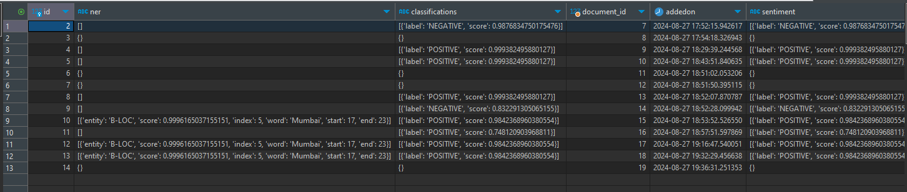

# Intelligent-Document-Processing

AI Document Processing application on Django web framework.

# Tools / Libraries Used
1. Hugging Face - Transformers - To apply AI Models.
2. Tesseract - Pytesseract - Extract texts from Documents.
3. pdf2image - Poppler - Convert PDF to Image file.

# Output:

1. Web page:

    Homepage:   
    
   
    Document Upload Page (with sample file operation):
    

2. Logs:
   

3. Database:
   
    User Table:
    

    Document Table:
    

    Extracted Text Table:
    

    AI Result Table:
    

